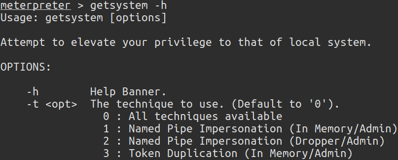

# Meterpreter getsystem 原理

Administrator -> System

## Technique

## Technique 1

> **Technique 1** creates a named pipe from Meterpreter. It also [creates and runs a service](https://github.com/rapid7/meterpreter/blob/master/source/extensions/priv/server/elevate/namedpipe.c) that runs *cmd.exe /c echo “some data” >\\.\pipe\[random pipe here]*. When the spawned cmd.exe connects to Meterpreter’s named pipe, Meterpreter has the opportunity to impersonate that security context. [Impersonation of clients](http://msdn.microsoft.com/en-us/library/windows/desktop/aa365573(v=vs.85).aspx) is a named pipes feature. The context of the service is SYSTEM, so when you impersonate it, you become SYSTEM.

由Meterpreter创建一个命名管道，并且创建一个服务，该服务运行`cmd.exe /c echo "some data" > \.\pipe[random pip here]`，当`cmd.exe`连接到Meterpreter的命名管道的时候，Meterpreter就有机会去模拟`cmd.exe`的security context，由于服务的context是System权限，所以Meterpreter也就在模拟之后获得了System权限。

至于模拟客户端的context，它是命名管道的一个特性，它的设计目的是为了让高权限的服务端代理低权限的客户端，然后以低权限的身份执行某些操作。

举个例子，有一个数据库限制访问IP，仅允许IP为S的主机直接访问，IP为C的主机如果想访问该数据库的话，首先需要建立命名管道连接S，S作为命名管道的服务端可以模拟C的身份，然后S再以该身份连接数据库，数据库再根据这个身份进行认证和授权。

具体到代码层面，命名管道服务端使用[`ImpersonateNamedPipeClient`](https://msdn.microsoft.com/en-us/library/windows/desktop/aa378618(v=vs.85).aspx)这个函数获取到客户端的access token，这样就可以模拟客户端的身份。在操作结束后，服务端使用[`RevertToSelf`](https://msdn.microsoft.com/en-us/library/windows/desktop/aa379317(v=vs.85).aspx)恢复到自己原始的token。

## Technique 2

> **Technique 2** is like technique 1. It creates a named pipe and impersonates the security context of the first client to connect to it. To create a client with the SYSTEM user context, this technique drops a DLL to disk(!) and schedules rundll32.exe as a service to run the DLL as SYSTEM. [The DLL](https://github.com/rapid7/meterpreter/blob/master/source/elevator/namedpipeservice.c) connects to the named pipe and that’s it. Look at [elevate_via_service_namedpipe2](https://github.com/rapid7/meterpreter/blob/master/source/extensions/priv/server/elevate/namedpipe.c) in Meterpreter’s source to see this technique.

Technique 2 和 Technique 1 类似，也是通过模拟命名管道客户端的security context，不同点在于这个方法是通过在磁盘上写入一个DLL，然后用`rundll32.exe`来运行该DLL来创建命名管道。由于这个方法会在磁盘上写入DLL，很容易被杀毒软件发现，所以不推荐使用这种方法。

## Technique 3

> **Technique 3** is a little different. [This technique](https://github.com/rapid7/meterpreter/blob/master/source/extensions/priv/server/elevate/tokendup.c) assumes you have SeDebugPrivileges—something getprivs can help with. It loops through all open services to find one that is running as SYSTEM and that you have permissions to inject into. It uses [reflective DLL injection](http://www.harmonysecurity.com/files/HS-P005_ReflectiveDllInjection.pdf) to run [its elevator.dll](https://github.com/rapid7/meterpreter/blob/master/source/elevator/tokendup.c) in the memory space of the service it finds. This technique also passes the current thread id (from Meterpreter) to elevator.dll. When run, elevator.dll gets the SYSTEM token, opens the primary thread in Meterpreter, and tries to apply the SYSTEM token to it.
>
> This technique’s implementation limits itself to x86 environments only. On the bright side, it does not require spawning a new process and it takes place entirely in memory.

这个方法假设Meterpreter进程拥有[`SeDebugPrivilege`](https://support.microsoft.com/en-us/help/131065/how-to-obtain-a-handle-to-any-process-with-sedebugprivilege)权限（可以借助使用`getprivs`命令来获得），它首先遍历所有服务，寻找一个以System权限运行并且我们有向其中注入的权限，然后使用[DLL反射注入](https://github.com/stephenfewer/ReflectiveDLLInjection)来运行[elevator.dll](https://github.com/rapid7/meterpreter/blob/master/source/elevator/tokendup.c)，该DLL会获取被注入进程的System权限的token，然后将它赋予Meterpreter的一个线程。

这个方法的优点是完全在内存中操作，并不会创建进程，缺点是只能在x86环境下运行。

## Reference

https://blog.cobaltstrike.com/2014/04/02/what-happens-when-i-type-getsystem/

https://msdn.microsoft.com/en-us/library/windows/desktop/aa365573(v=vs.85).aspx

https://msdn.microsoft.com/en-us/library/windows/desktop/bb530716(v=vs.85).aspx

https://support.microsoft.com/en-us/help/131065/how-to-obtain-a-handle-to-any-process-with-sedebugprivilege