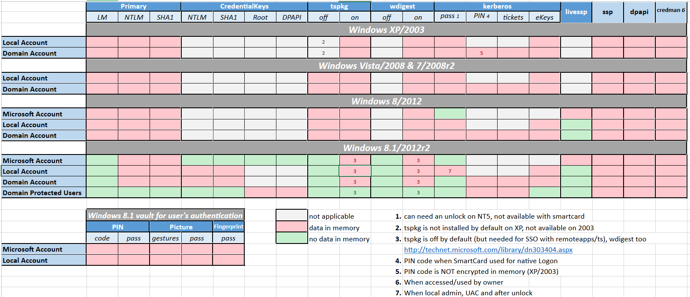
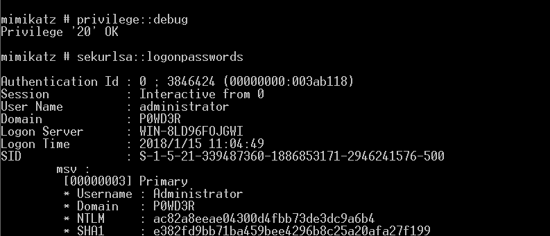

# mimikatz

## 凭据

使用mimikatz的其中一个用途是获取用户凭据，所以首先介绍什么是凭据。

- 在Windows启动时，Local Security Authority Subsystem，也就是本地安全认证系统也随之以 **lsass.exe** 的形式启动。其作用为验证用户并分配相应权限以及记录日志。
- 用户输入用户名和密码，经过lsass.exe处理后，用户凭据将存储在内存中，以便后续需要验证用户身份的时候操作系统的安全相关包可以访问到用户信息，从而实现SSO（Single Sign On）。
- Local Security Authority Subsystem支持多种认证方法，比如Kerberos， Wdigest等等，由于认证形式的不同，导致内存中凭据的存储形式也不同，可能存在明文。

各版本Windows中凭据的存储情况：

## sekurlsa

mimikatz中获取用户凭据的模块

> This module extracts **passwords, keys, pin codes, tickets** from the memory of **lsass** (Local Security Authority Subsystem Service) the process by default, or a minidump of it! 

example:

## 权限要求

> When working with `lsass` process, `mimikatz` needs some rights, choice:
>
> - **Administrator**, to get `debug` privilege via [`privilege::debug`](https://github.com/gentilkiwi/mimikatz/wiki/module-~-privilege#debug)
> - **`SYSTEM`** account, via post exploitation tools, scheduled tasks, `psexec -s ...` - in this case `debug` privilege is not needed.
>
> Without rights to access `lsass` process, all commands will fail with an error like this: `ERROR kuhl_m_sekurlsa_acquireLSA ; Handle on memory (0x00000005)` *(except when working with a minidump)*.

## Tips

- meterpreter在执行`load mimikatz`时默认加载32位，如果目标机器是64位会影响程序运行，解决方法是先`migrate`到一个64位进程下再load。

## Reference

https://github.com/gentilkiwi/mimikatz/wiki