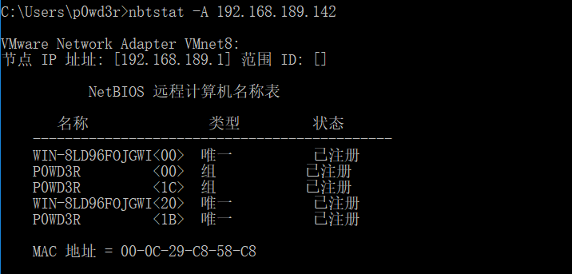

# NetBIOS (Network Basic Input/Output System)

在OSI七层模型中的会话层提供服务，严格来说是一种API。

NetBIOS主要提供三种类型的服务：

- 名称服务（Name Service）：包括名称注册和名称解析，运行在UDP的137端口，使用`nbtstat -A`就是通过137端口进行通信：
  - 
  - 
- 数据报分发服务（Datagram distribution service）：负责发送和接受普通数据报文和广播数据报文，运行在UDP的138端口
- 会话服务（Session service）：负责建立会话连接，运行在TCP的139端口

NetBIOS Name 和 Host Name 的区别：

- > The NetBIOS name is 16 ASCII characters, however Microsoft limits the host name to 15 characters and reserves the 16th character as a NetBIOS **Suffix**.

- > Generally the host name of a Windows computer is based on the NetBIOS name plus the Primary DNS Suffix, which are both set in the System Properties dialog box.

NetBIOS Suffixes（名字的最后一个字符的意义）：

> The NetBIOS Suffix, alternately called the NetBIOS End Character (endchar), is the 16th character of a NetBIOS name and indicates service type for the registered name. The number of record types is limited to 255; some commonly used values are:
>
> For unique names:
>
> - 00: Workstation Service (workstation name)
> - 03: [Windows Messenger service](https://en.wikipedia.org/wiki/Windows_Messenger_service)
> - 06: [Remote Access Service](https://en.wikipedia.org/wiki/Remote_Access_Service)
> - 20: [File Service](https://en.wikipedia.org/wiki/File_server) (also called Host Record)
> - 21: [Remote Access Service](https://en.wikipedia.org/wiki/Remote_Access_Service) client
> - 1B: [Domain](https://en.wikipedia.org/wiki/Windows_Server_domain) Master [Browser](https://en.wikipedia.org/wiki/Browser_service) – Primary Domain Controller for a domain
> - 1D: Master Browser
>
> For group names:
>
> - 00: Workstation Service (workgroup/domain name)
> - 1C: [Domain Controllers](https://en.wikipedia.org/wiki/Domain_controller) for a domain (group record with up to 25 IP addresses)
> - 1E: Browser Service Elections

上面`nbtstat`命令的图中，名称为“P0WD3R\<1c\>”表示该机器是P0WD3R域中的域控。

在Ubuntu中扫描NetBIOS Name Service：`apt-get install nbtscan && nbtscan -vh -f ip.txt`

现代的NetBIOS是基于TCP/IP的，所以同样适用于广域网。