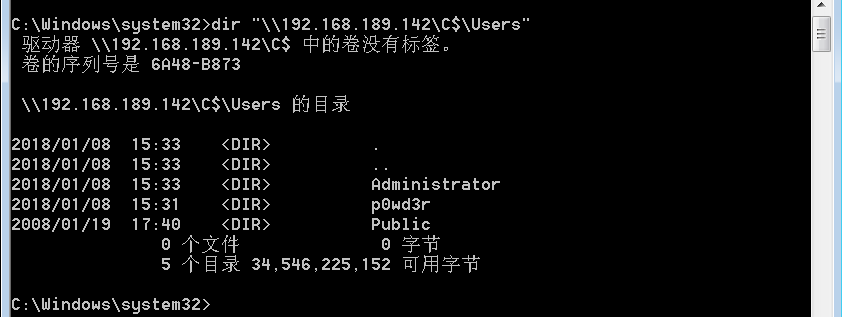

# Windows shared resource

Windows的文件共享基于SMB（Server Message Block）实现，具体定义详见：https://zh.wikipedia.org/wiki/%E4%BC%BA%E6%9C%8D%E5%99%A8%E8%A8%8A%E6%81%AF%E5%8D%80%E5%A1%8A

`net share`：查看所有共享资源

通过IPC$连接可访问多个盘符

`net use`：与网络上的共享资源建立或断开会话连接，需认证，不仅限于域环境内，通过139或445端口来通信，使用的是SMB协议。

example：

普通用户登录DM，尝试使用`net use`与DC建立连接：

可以看到首先尝试用当前用户身份登录，域普通用户没有访问权限，所以使用域管理员账号进行访问。

成功建立连接后可使用`net use`查看当前会话：

可以在当前会话中使用`dir`、`copy`等文件命令操作共享资源：

常见攻击手法是用`copy`上传目标文件然后用`at`或者`schtasks`启动定时任务来运行：http://www.xfocus.net/articles/200303/493.html

经测试（仅测试了XP），访问非域内机器的共享资源时，需要满足以下两个条件：

- 防火墙无限制
- `secpoc.msc`中“本地账户的共享和安全模式”设置为经典：
  - 
  - 当该设置为仅来宾时，用户身份会被映射为guest，而默认情况下guest是没有开启的，所以也就无法访问。

## Reference

https://zh.wikipedia.org/wiki/%E4%BC%BA%E6%9C%8D%E5%99%A8%E8%A8%8A%E6%81%AF%E5%8D%80%E5%A1%8A

http://www.xfocus.net/articles/200303/493.html